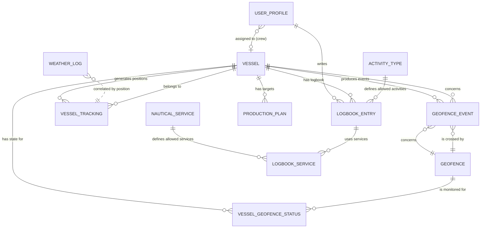

# GeoKanban V3 — Ontologia Formale del Sistema

> Versione: V3.1 · Data: 27 Febbraio 2026
> Dominio: Monitoraggio e gestione operativa di cantiere navale per costruzione diga foranea — Genova

---

## 1. Dominio e Scopo

GeoKanban modella il **ciclo operativo** di navi bulk carrier che trasportano materiale da siti di carico a un'area di scarico (Unloading Site) davanti al porto di Genova, per la costruzione della diga foranea.

Il sistema risponde a quattro domande fondamentali:
1. **Dove sono le navi adesso?** → Posizionamento in tempo reale (automatico)
2. **Cosa stanno facendo?** → Stato operativo derivato da geofence (automatico)
3. **Come lo stanno facendo?** → Dettagli operativi dal logbook della crew (manuale)
4. **Stiamo raggiungendo gli obiettivi?** → Target di produzione mensile

### 1.1 Due Sorgenti di Verità

Il sistema è **ibrido deterministico + narrativo**:

```
SORGENTE 1 — AUTOMATICA (Tracking Engine)
  Il motore geofence osserva le posizioni GPS e deduce:
  → COSA fa la nave (Loading, Unloading, Navigation...)
  → QUANDO è entrata/uscita da un'area
  → Frequenza: ogni ~20 minuti

SORGENTE 2 — MANUALE (Crew Logbook)
  La crew riporta i dettagli operativi che il GPS non può vedere:
  → COME è arrivata (pilota, rimorchiatori, ormeggiatori)
  → Tempistiche precise delle manovre
  → Servizi nautici utilizzati
  → Annotazioni operative

Le due sorgenti si sovrappongono nel tempo e si completano a vicenda.
Il logbook non sostituisce il tracking — lo arricchisce.
```

---

## 2. Ruoli Utente

### 2.1 ADMIN
> Accesso completo a tutto il sistema. Gestisce dati master, visualizza tutte le navi, edita la tabella Activity.

| Area | Permessi |
|------|----------|
| Map | Tutte le navi, tutte le geofence |
| Vessel Activity | Tutte le righe — lettura e scrittura |
| Production Targets | Tutte le navi — lettura e scrittura |
| Crew Logbook | Lettura di tutti i logbook |
| DB Manager | CRUD su Vessels, Geofences, Activities, Nautical Services |
| User Management | Crea/rimuove utenti crew, assegna a nave |

### 2.2 CREW
> Accesso limitato alla propria nave. Compila il logbook giornaliero.

| Area | Permessi |
|------|----------|
| Map | Solo la propria nave, tutte le geofence |
| Vessel Activity | Solo le righe della propria nave — sola lettura |
| Production Targets | Non visibile |
| Crew Logbook | Scrittura del logbook della propria nave |
| DB Manager | Non visibile |
| User Management | Non visibile |

### 2.3 USER_PROFILE (Profilo Utente)

| Attributo | Tipo | Vincolo | Descrizione |
|-----------|------|---------|-------------|
| `id` | UUID | PK, FK → auth.users | ID Supabase Auth |
| `email` | VARCHAR | UNIQUE, NOT NULL | Email di accesso |
| `display_name` | VARCHAR | NOT NULL | Nome visualizzato |
| `role` | VARCHAR | NOT NULL, ∈ {admin, crew} | Ruolo nel sistema |
| `vessel_id` | UUID | FK → Vessel, NULL per admin | Nave di appartenenza (crew only) |
| `is_active` | BOOLEAN | default true | Account attivo/disattivato |
| `created_at` | TIMESTAMPTZ | | |

> [!IMPORTANT]
> La relazione **crew → vessel** è il cardine della sicurezza. Ogni crew vede e scrive SOLO per la nave a cui è assegnato. Un admin ha `vessel_id = NULL` perché ha accesso a tutte.

---

## 3. Entità Fondamentali

### 3.1 VESSEL (Nave)
> L'unità operativa primaria. Ogni nave è un attore autonomo nel dominio.

| Attributo | Tipo | Vincolo | Descrizione |
|-----------|------|---------|-------------|
| `id` | UUID | PK | Identificatore univoco |
| `mmsi` | VARCHAR | UNIQUE, NOT NULL | Maritime Mobile Service Identity — chiave di correlazione con Datalastic API |
| `imo` | VARCHAR | UNIQUE | International Maritime Organization number |
| `name` | VARCHAR | NOT NULL | Nome nave (es. "SIDER BEAR") |
| `vessel_type` | VARCHAR | | Classificazione (es. "Cargo Bulk Carrier") |
| `flag` | VARCHAR | | Bandiera di registrazione |
| `avg_cargo` | NUMERIC | ≥ 0 | Carico medio per viaggio (tonnellate) |
| `standard_cycle_hours` | NUMERIC | > 0, default 24 | Durata standard di un ciclo completo Loading→Unloading |
| `lifetime_trips` | INTEGER | ≥ 0 | Contatore storico cumulativo dei viaggi |
| `default_loading_id` | UUID | FK → Geofence | Sito di carico abituale |
| `default_base_id` | UUID | FK → Geofence | Porto base abituale |
| `default_unloading_id` | UUID | FK → Geofence | Sito di scarico abituale |

> [!IMPORTANT]
> Il **MMSI è la chiave di correlazione esterna**. È il ponte tra il database interno e l'API Datalastic. Se il MMSI è errato o mancante, la nave non viene tracciata. Se aggiungi una nave nel tab Vessels, alla prossima invocazione della Edge Function verrà interrogata su Datalastic. Se la rimuovi, non verrà più interrogata.

---

### 3.2 GEOFENCE (Area Geografica Poligonale)
> Zona delimitata che, se attraversata da una nave, genera un evento. È il **trigger** logico di tutta l'attività.

| Attributo | Tipo | Vincolo | Descrizione |
|-----------|------|---------|-------------|
| `id` | UUID | PK | Identificatore univoco |
| `name` | VARCHAR | NOT NULL | Nome identificativo (es. "Unloading Site") |
| `polygon_coords` | JSONB | NOT NULL, ≥3 vertici | Array di `[lat, lon]` che definisce il poligono |
| `nature` | VARCHAR | NOT NULL, ∈ ENUM | Determina il **tipo di attività** (vedi sotto) |
| `family` | VARCHAR | | Raggruppamento logico (es. "ROADSTEAD") |
| `color` | VARCHAR | | Colore per rendering mappa |

**Valori ammessi per `nature`** (ontologia delle attività automatiche):

```
nature                → Attività derivata     → Significato operativo
─────────────────────────────────────────────────────────────────────
loading_site          → Loading               → Caricamento materiale
unloading_site        → Unloading             → Scarico materiale (diga)
base_port             → Port Operations       → Operazioni portuali / sosta
anchorage             → Anchorage             → Rada / attesa in ancoraggio
transit               → Transit               → Zona di transito
mooring               → Mooring               → Ormeggio
```

> [!NOTE]
> Ogni geofence è definito **esclusivamente come poligono** tramite `polygon_coords`. Il motore utilizza l'algoritmo Ray Casting (point-in-polygon) per determinare se una nave si trova all'interno dell'area.

---

### 3.3 ACTIVITY_TYPE (Vocabolario Attività — Dato Master)
> Dizionario controllato di tutte le attività permesse nel sistema. Usato come lookup per il logbook e il tracking.

| Attributo | Tipo | Vincolo | Descrizione |
|-----------|------|---------|-------------|
| `id` | UUID | PK | |
| `code` | VARCHAR | UNIQUE, NOT NULL | Codice breve (es. "NAV", "LOAD") |
| `name` | VARCHAR | NOT NULL | Nome in inglese (es. "Navigation") |
| `description` | VARCHAR | | Descrizione estesa |
| `category` | VARCHAR | ∈ ENUM | Categoria funzionale |

**Valori attuali:**

| Code | Name | Category | Description |
|------|------|----------|-------------|
| `NAV` | Navigation | navigation | Transit between geofences |
| `DOCK` | Mooring | mooring | Mooring operation upon arrival |
| `UNDOCK` | Unmooring | mooring | Unmooring operation before departure |
| `LOAD` | Loading | cargo | Material loading operation |
| `UNLOAD` | Unloading | cargo | Material unloading operation |
| `REFUEL` | Bunkering | supply | Fuel supply operation |
| `MAINT` | Maintenance | maintenance | Engine/hull maintenance |

> [!NOTE]
> L'admin gestisce questa tabella dal DB Manager. Se aggiunge un'attività, questa diventa disponibile nel dropdown del logbook della crew. Se la rimuove, non potrà più essere selezionata. **Nessun testo libero** — solo selezione da questa lista.

---

### 3.4 NAUTICAL_SERVICE (Vocabolario Servizi Nautici — Dato Master)
> Dizionario controllato dei servizi nautici che possono essere associati alle manovre.

| Attributo | Tipo | Vincolo | Descrizione |
|-----------|------|---------|-------------|
| `id` | UUID | PK | |
| `code` | VARCHAR | UNIQUE, NOT NULL | Codice breve (es. "TUG", "PIL") |
| `name` | VARCHAR | NOT NULL | Nome in inglese (es. "Tugboat") |
| `provider` | VARCHAR | | Fornitore del servizio |

**Valori attuali:**

| Code | Name | Provider |
|------|------|----------|
| `TUG` | Tugboat | Porto Services SRL |
| `PIL` | Pilot | Marine Pilots Ltd |
| `MOOR` | Mooring Crew | Mooring Services Inc |

---

### 3.5 VESSEL_TRACKING (Posizione Registrata)
> Ogni record è un campione della posizione di una nave in un istante. Sorgente: Datalastic API. Frequenza: ~1 record ogni 20 minuti per nave.

| Attributo | Tipo | Vincolo | Descrizione |
|-----------|------|---------|-------------|
| `id` | UUID | PK | |
| `vessel_id` | UUID | FK → Vessel, NOT NULL | Quale nave |
| `mmsi` | VARCHAR | NOT NULL | MMSI ridondante (per query rapide) |
| `lat` | NUMERIC | NOT NULL | Latitudine WGS84 |
| `lon` | NUMERIC | NOT NULL | Longitudine WGS84 |
| `speed` | NUMERIC | ≥ 0 | Velocità in nodi |
| `heading` | NUMERIC | 0–360 | Rotta in gradi |
| `status` | VARCHAR | ∈ {underway, anchored} | Derivato: speed > 0.5 → underway |
| `timestamp` | TIMESTAMPTZ | NOT NULL | Momento della rilevazione |
| `raw_data` | JSONB | | Payload completo Datalastic (audit) |

> [!NOTE]
> La granularità temporale è ~20 minuti. Transizioni geofence rapide (< 20 min dentro un'area) possono non essere rilevate. Per il dominio operativo (cicli di ore/giorni) è adeguata.

---

### 3.6 GEOFENCE_EVENT (Evento di Transizione — Sorgente Automatica)
> Rappresenta il **momento in cui una nave attraversa il confine di un geofence**. Generato automaticamente dal motore. È l'atomo fondamentale del tracking.

| Attributo | Tipo | Vincolo | Descrizione |
|-----------|------|---------|-------------|
| `id` | UUID | PK | |
| `vessel_id` | UUID | FK → Vessel, NOT NULL | |
| `geofence_id` | UUID | FK → Geofence, NOT NULL | |
| `event_type` | VARCHAR | ∈ {ENTER, EXIT}, NOT NULL | Tipo di transizione |
| `timestamp` | TIMESTAMPTZ | NOT NULL | Momento della transizione |
| `confidence_score` | NUMERIC | 0.0–1.0 | 1.0 = rilevato, 0.8 = inferito, 0.5 = manuale |
| `processed` | BOOLEAN | default false | Flag per elaborazioni downstream |

> [!TIP]
> Il `confidence_score` permette di distinguere:
> - **1.0**: Transizione rilevata dal motore in tempo reale
> - **0.8**: Inferita dalla prima posizione disponibile (nave già dentro al primo check)
> - **0.5**: Inserita manualmente dall'admin

---

### 3.7 VESSEL_GEOFENCE_STATUS (Memoria di Stato)
> Tabella di "memoria" che tiene traccia dello stato corrente di ogni coppia nave-geofence. Serve al motore per rilevare le transizioni.

| Attributo | Tipo | Vincolo | Descrizione |
|-----------|------|---------|-------------|
| `vessel_id` | UUID | PK (composita), FK → Vessel | |
| `geofence_id` | UUID | PK (composita), FK → Geofence | |
| `status` | VARCHAR | ∈ {INSIDE, OUTSIDE}, NOT NULL | Stato attuale |
| `last_check_at` | TIMESTAMPTZ | | Ultimo controllo |
| `last_transition_at` | TIMESTAMPTZ | | Ultima transizione rilevata |

> [!IMPORTANT]
> Questa è una **tabella di stato, non di storia**. Contiene esattamente N×M record (navi × geofence). Non cresce nel tempo. È il "cervello" del motore di tracking.

---

### 3.8 LOGBOOK_ENTRY (Voce del Logbook — Sorgente Manuale)
> Record scritto dalla crew. Ogni riga rappresenta un'attività svolta, con tempistiche e servizi nautici associati.

| Attributo | Tipo | Vincolo | Descrizione |
|-----------|------|---------|-------------|
| `id` | UUID | PK | |
| `vessel_id` | UUID | FK → Vessel, NOT NULL | Nave di riferimento |
| `user_id` | UUID | FK → User_Profile, NOT NULL | Chi ha compilato |
| `log_date` | DATE | NOT NULL | Giorno dell'attività |
| `activity_id` | UUID | FK → Activity_Type, NOT NULL | Attività (da dropdown) |
| `start_time` | TIMESTAMPTZ | NOT NULL | Ora inizio attività |
| `end_time` | TIMESTAMPTZ | NULL | Ora fine (NULL se in corso) |
| `notes` | TEXT | | Note operative libere |
| `status` | VARCHAR | ∈ {draft, submitted}, default draft | |
| `submitted_at` | TIMESTAMPTZ | | Quando è stato inviato |
| `created_at` | TIMESTAMPTZ | | |

> [!NOTE]
> Il campo `activity_id` è un **FK alla tabella Activity_Type** — la crew non scrive testo libero per l'attività, ma seleziona da un menu a tendina popolato dal vocabolario controllato. Questo garantisce che ogni inserimento sia interpretabile dal sistema.

---

### 3.9 LOGBOOK_SERVICE (Servizio Nautivo associato a Voce Logbook)
> Per ogni voce del logbook che coinvolge manovre (Mooring/Unmooring), registra i servizi nautici utilizzati.

| Attributo | Tipo | Vincolo | Descrizione |
|-----------|------|---------|-------------|
| `id` | UUID | PK | |
| `logbook_entry_id` | UUID | FK → Logbook_Entry, NOT NULL | Voce del logbook |
| `service_id` | UUID | FK → Nautical_Service, NOT NULL | Servizio (da dropdown) |
| `quantity` | INTEGER | ≥ 0, default 1 | Quanti (es. 2 tugboats) |
| `start_time` | TIMESTAMPTZ | | Ora inizio servizio |
| `end_time` | TIMESTAMPTZ | | Ora fine servizio |
| `notes` | TEXT | | Note specifiche |

> [!NOTE]
> Anche qui `service_id` è un FK — la crew seleziona "Pilot", "Tugboat" o "Mooring Crew" dal dropdown, non scrive testo libero. La `quantity` è utile per i rimorchiatori (spesso 1 o 2).

---

### 3.10 PRODUCTION_PLAN (Piano di Produzione)
> Target mensile per nave. Visibile solo all'admin.

| Attributo | Tipo | Vincolo | Descrizione |
|-----------|------|---------|-------------|
| `id` | UUID | PK | |
| `vessel_id` | UUID | FK → Vessel, NOT NULL | |
| `period_name` | VARCHAR | NOT NULL | Periodo (es. "February 2026") |
| `target_trips` | INTEGER | ≥ 0 | Obiettivo viaggi |
| `target_quantity` | NUMERIC | ≥ 0 | Obiettivo tonnellate |
| `actual_trips` | INTEGER | ≥ 0 | Viaggi effettivi |
| `actual_quantity` | NUMERIC | ≥ 0 | Tonnellate effettive |
| `status` | VARCHAR | ∈ {active, completed, cancelled} | |

---

### 3.11 WEATHER_LOG (Registro Meteo)
> Condizioni meteorologiche alla posizione della nave.

| Attributo | Tipo | Vincolo | Descrizione |
|-----------|------|---------|-------------|
| `id` | UUID | PK | |
| `location_name` | VARCHAR | | Identificativo (es. "Vessel: 314836000") |
| `lat`, `lon` | NUMERIC | | Coordinate del campione |
| `temperature` | NUMERIC | | Temperatura aria (°C) |
| `wind_speed` | NUMERIC | | Velocità vento (km/h) |
| `wind_direction` | NUMERIC | | Direzione vento (°) |
| `wave_height` | NUMERIC | | Altezza onde (m) |
| `weather_code` | INTEGER | | Codice WMO |
| `timestamp` | TIMESTAMPTZ | | Momento della rilevazione |

---

## 4. Relazioni



### Cardinalità chiave:

| Relazione | Cardinalità | Nota |
|-----------|-------------|------|
| Vessel → Tracking | 1 : N | ~612 posizioni per nave in 10 giorni |
| Vessel → Geofence Events | 1 : N | ~7-35 eventi per nave in 10 giorni |
| Vessel → Status | 1 : M | 1 record per geofence (M geofence) |
| Vessel → Production | 1 : N | 1 per mese |
| Vessel → Logbook Entries | 1 : N | ~5-10 voci per giorno |
| Vessel → Crew Users | 1 : N | Più crew per nave |
| Logbook Entry → Services | 1 : N | 0-3 servizi per manovra |
| Activity_Type → Logbook | 1 : N | Lookup FK |
| Nautical_Service → Logbook_Service | 1 : N | Lookup FK |
| (Vessel, Geofence) → Status | 1 : 1 | Chiave composita |

---

## 5. Il Logbook: Raccordo tra Automatico e Manuale

### 5.1 Timeline Sovrapposta

```
TIMELINE REALE DELLA NAVE (esempio: arrivo all'Unloading Site):
━━━━━━━━━━━━━━━━━━━━━━━━━━━━━━━━━━━━━━━━━━━━━━━━━━━━━━━━━━━━

SORGENTE 1 — Tracking automatico (cosa sappiamo):
    ──Navigation──────┤ ENTER Unloading ├───Inside──────┤ EXIT ├──Nav──
                      14:00                              17:30

SORGENTE 2 — Logbook della crew (cosa aggiungiamo):
    ──Navigation──┤ Mooring ├─── Unloading ───┤ Unmooring ├──Nav──
                  13:30-14:20   14:30-17:00    17:00-17:25
                      │
                      ├─ Pilot:        13:45 → 14:25
                      ├─ Tugboats (2): 13:50 → 14:15
                      └─ Mooring Crew: 14:00 → 14:20

RISULTATO COMBINATO (visione completa):
    Il tracking dice COSA e QUANDO.
    Il logbook dice COME (servizi nautici, tempistiche precise delle manovre).
```

### 5.2 Esempio Logbook Giornaliero

```
╔═══════════════════════════════════════════════════════════════╗
║  DAILY LOGBOOK — SIDER BEAR — 27 Feb 2026                   ║
╠═══════════════════════════════════════════════════════════════╣
║                                                               ║
║  #1  Navigation           06:00 → 13:30                       ║
║                                                               ║
║  #2  Mooring              13:30 → 14:20                       ║
║      ├─ Pilot:            YES   (13:45 → 14:25)              ║
║      ├─ Tugboat:          ×2    (13:50 → 14:15)              ║
║      └─ Mooring Crew:     YES   (14:00 → 14:20)              ║
║                                                               ║
║  #3  Unloading            14:30 → 17:00                       ║
║                                                               ║
║  #4  Unmooring            17:00 → 17:25                       ║
║      ├─ Pilot:            YES   (17:05 → 17:30)              ║
║      ├─ Tugboat:          ×0                                  ║
║      └─ Mooring Crew:     YES   (17:05 → 17:20)              ║
║                                                               ║
║  #5  Navigation           17:30 → ...                         ║
║                                                               ║
║  Submitted by: M. Rossi (Crew)  at 27/02/2026 18:00          ║
╚═══════════════════════════════════════════════════════════════╝
```

### 5.3 Regole del Logbook

- **Ogni voce ha un'attività selezionata dal dropdown** (FK → Activity_Type). Nessun testo libero.
- **I servizi nautici sono selezionati dal dropdown** (FK → Nautical_Service). Nessun testo libero.
- **La crew vede e scrive solo per la propria nave.**
- **Le voci sono in ordine cronologico** — end_time della voce N ≤ start_time della voce N+1.
- **Le voci mooring/unmooring tipicamente hanno servizi nautici associati.**
- **Le voci navigation/loading/unloading tipicamente NON hanno servizi nautici.**
- Il campo `notes` è l'unico campo a testo libero — per annotazioni operative eccezionali.

---

## 6. Dati Master (Vocabolari Controllati)

I dati master sono le **tabelle di lookup** del sistema. Garantiscono che ogni dato inserito — sia dal tracking automatico che dal logbook — sia interpretabile e consistente.

```
┌─────────────────────────────────────────────────────────────┐
│                    DB MANAGER (Admin Only)                   │
├──────────┬──────────┬──────────────┬────────────────────────┤
│ Vessels  │ Geofences│ Activities   │ Nautical Services      │
├──────────┼──────────┼──────────────┼────────────────────────┤
│ MMSI     │ Name     │ Code: NAV    │ Code: PIL              │
│ Name     │ Polygon  │ Code: DOCK   │ Code: TUG              │
│ IMO      │ Nature   │ Code: UNDOCK │ Code: MOOR             │
│ Type     │ Family   │ Code: LOAD   │                        │
│ Avg Cargo│ Color    │ Code: UNLOAD │ Provider info          │
│          │          │ Code: REFUEL │                        │
│          │          │ Code: MAINT  │                        │
├──────────┴──────────┴──────────────┴────────────────────────┤
│ Add/Edit/Delete → changes propagate to:                     │
│   • Vessel added → tracked by Edge Function                 │
│   • Vessel removed → stops being tracked                    │
│   • Activity added → appears in Logbook dropdown            │
│   • Activity removed → no longer selectable                 │
│   • Service added → appears in Service dropdown             │
│   • Geofence added → tracked by Geofence Engine             │
└─────────────────────────────────────────────────────────────┘
```

---

## 7. Regole di Consistenza

### R1 — Alternanza ENTER/EXIT
> Per ogni coppia (vessel, geofence), gli eventi DEVONO alternare ENTER e EXIT.

```
✅ ENTER → EXIT → ENTER → EXIT
❌ ENTER → ENTER (violazione)
❌ EXIT → EXIT (violazione)
```

**Eccezione**: Il primo evento per una coppia può essere EXIT (nave già dentro quando il tracking è iniziato).

### R2 — Coerenza Status ↔ Events
> `vessel_geofence_status.status` DEVE essere coerente con l'ultimo evento registrato.

### R3 — Derivazione dell'Attività Automatica
> L'attività automatica è SEMPRE derivata dalla `nature` del geofence, mai dichiarata direttamente.

### R4 — Unicità temporale del tracking
> Non possono esistere due record `vessel_tracking` per la stessa nave con timestamp identico (< 1s).

### R5 — Polygon valido
> `polygon_coords` DEVE essere un array JSON con almeno 3 coordinate `[lat, lon]`. Poligono implicitamente chiuso.

### R6 — Production Plan unico per periodo
> Per ogni (vessel_id, period_name) al massimo un production_plan.

### R7 — Crew vede solo la propria nave
> Un utente con role=crew e vessel_id=X può leggere/scrivere SOLO dati relativi al vessel X. Enforced via RLS.

### R8 — Logbook usa solo vocabolario controllato
> `logbook_entry.activity_id` DEVE essere un FK valido verso `activity_type`. `logbook_service.service_id` DEVE essere un FK valido verso `nautical_service`. Nessun valore libero.

### R9 — Cronologia logbook
> Le voci del logbook per una nave in un giorno devono essere cronologicamente ordinate senza sovrapposizioni.

---

## 8. Dipendenze Logiche

```
                    ┌─────────────────┐
                    │   DATALASTIC    │  (API esterna)
                    │   API           │
                    └────────┬────────┘
                             │ MMSI → posizione
                             ▼
┌─────────┐    join    ┌─────────────────┐     ┌──────────────┐
│ VESSELS │◄───────────│ VESSEL_TRACKING │     │ OPEN-METEO   │
└────┬────┘            └────────┬────────┘     │ API          │
     │                          │               └──────┬───────┘
     │                          │ point-in-polygon     │
     │                          ▼                      ▼
     │              ┌───────────────────────┐  ┌──────────────┐
     │              │ VESSEL_GEOFENCE_STATUS│  │ WEATHER_LOG  │
     │              └───────────┬───────────┘  └──────────────┘
     │                          │ INSIDE ≠ prev? → evento!
     │                          ▼
     │              ┌───────────────────┐
     ├──────────────│ GEOFENCE_EVENTS   │  (SORGENTE 1: automatica)
     │              └───────────┬───────┘
     │                          │
     │   ┌─────────────┐        │ merge
     └──►│ GEOFENCES   │        │
          └─────────────┘        ▼
                        ┌───────────────────┐
     ┌──────────────┐   │ COMBINED ACTIVITY │  (visione completa)
     │ ACTIVITY_TYPE│   │ TIMELINE          │
     └──────┬───────┘   └───────────────────┘
            │                    ▲
            │ dropdown           │ merge
            ▼                    │
     ┌───────────────────┐       │
     │ LOGBOOK_ENTRY     │───────┘  (SORGENTE 2: manuale)
     └───────────┬───────┘
                 │
     ┌───────────┴──────────┐
     │ LOGBOOK_SERVICE      │
     └───────────┬──────────┘
                 │ dropdown
     ┌───────────┴──────────┐
     │ NAUTICAL_SERVICE     │
     └──────────────────────┘
```

### Dipendenze per entità:

| Entità | Dipende da | Alimenta |
|--------|-----------|----------|
| **Vessel** | Nulla (entità radice) | Tutto il sistema |
| **Geofence** | Nulla (entità radice) | Events, Status |
| **Activity_Type** | Nulla (dato master) | Logbook dropdown |
| **Nautical_Service** | Nulla (dato master) | Logbook Service dropdown |
| **User_Profile** | Supabase Auth, Vessel | Logbook, RLS |
| **Vessel_Tracking** | Vessel, Datalastic API | Status check, Weather |
| **Vessel_Geofence_Status** | Vessel, Geofence, Tracking | Geofence Events |
| **Geofence_Event** | Vessel, Geofence, Status | Activity Timeline |
| **Logbook_Entry** | Vessel, User, Activity_Type | Combined Timeline |
| **Logbook_Service** | Logbook_Entry, Nautical_Service | Operational detail |
| **Production_Plan** | Vessel | Dashboard KPI |
| **Weather_Log** | Tracking (posizione) | Audit ambientale |

---

## 9. Ciclo Operativo (Modello del Dominio)

```
    ┌──────────────┐
    │ LOADING SITE │  (es. Vado Scassa Nord, MC_1, PB_Briccole)
    │              │
    │  Activity:   │  La nave carica materiale
    │  LOADING     │  Duration: 6-20 hours
    │              │  Logbook: LOAD activity
    └──────┬───────┘
           │  EXIT geofence
           │  Logbook: UNDOCK + services (Pilot, Tugboat, Mooring Crew)
           │
           │  Navigation (2-6 hours)
           │  Logbook: NAV activity
           │
           │  ENTER geofence
           │  Logbook: DOCK + services (Pilot, Tugboat, Mooring Crew)
           ▼
    ┌──────────────┐
    │UNLOADING SITE│  (Breakwater construction, Genova)
    │              │
    │  Activity:   │  La nave scarica materiale
    │  UNLOADING   │  Duration: 30 min - 3 hours
    │              │  Logbook: UNLOAD activity
    └──────┬───────┘
           │  EXIT geofence
           │  Logbook: UNDOCK + services
           │
           │  Navigation (2-6 hours)
           │  Logbook: NAV activity
           │
           │  ENTER geofence
           │  Logbook: DOCK + services
           ▼
    ┌──────────────┐
    │ LOADING SITE │  (repeat)
    └──────────────┘

    ═══ One complete cycle = Loading + Nav + Unloading + Nav ═══
    ═══ Typical duration: 12-48 hours (standard_cycle_hours)  ═══
```

---

## 10. Schema Relazionale Normalizzato (3NF)

```sql
-- ═══ IDENTITY & ACCESS ═══

USER_PROFILE (
    id              UUID PRIMARY KEY REFERENCES auth.users(id),
    email           VARCHAR UNIQUE NOT NULL,
    display_name    VARCHAR NOT NULL,
    role            VARCHAR NOT NULL CHECK (role IN ('admin', 'crew')),
    vessel_id       UUID REFERENCES VESSEL(id),  -- NULL for admin
    is_active       BOOLEAN DEFAULT true,
    created_at      TIMESTAMPTZ DEFAULT now()
)

-- ═══ MASTER DATA (Controlled Vocabularies) ═══

VESSEL (
    id          UUID PRIMARY KEY DEFAULT gen_random_uuid(),
    mmsi        VARCHAR UNIQUE NOT NULL,
    imo         VARCHAR UNIQUE,
    name        VARCHAR NOT NULL,
    vessel_type VARCHAR,
    flag        VARCHAR,
    avg_cargo   NUMERIC DEFAULT 0 CHECK (avg_cargo >= 0),
    standard_cycle_hours NUMERIC DEFAULT 24 CHECK (standard_cycle_hours > 0),
    lifetime_trips INTEGER DEFAULT 0 CHECK (lifetime_trips >= 0),
    default_loading_id   UUID REFERENCES GEOFENCE(id),
    default_base_id      UUID REFERENCES GEOFENCE(id),
    default_unloading_id UUID REFERENCES GEOFENCE(id),
    created_at  TIMESTAMPTZ DEFAULT now(),
    updated_at  TIMESTAMPTZ DEFAULT now()
)

GEOFENCE (
    id              UUID PRIMARY KEY DEFAULT gen_random_uuid(),
    name            VARCHAR NOT NULL,
    nature          VARCHAR NOT NULL CHECK (nature IN (
                        'loading_site','unloading_site','base_port',
                        'anchorage','transit','mooring'
                    )),
    polygon_coords  JSONB NOT NULL,
    family          VARCHAR,
    color           VARCHAR DEFAULT '#3b82f6',
    created_at      TIMESTAMPTZ DEFAULT now()
)

ACTIVITY_TYPE (
    id          UUID PRIMARY KEY DEFAULT gen_random_uuid(),
    code        VARCHAR UNIQUE NOT NULL,
    name        VARCHAR NOT NULL,
    description VARCHAR,
    category    VARCHAR CHECK (category IN (
                    'navigation','mooring','cargo','supply','maintenance'
                )),
    created_at  TIMESTAMPTZ DEFAULT now()
)

NAUTICAL_SERVICE (
    id          UUID PRIMARY KEY DEFAULT gen_random_uuid(),
    code        VARCHAR UNIQUE NOT NULL,
    name        VARCHAR NOT NULL,
    provider    VARCHAR,
    created_at  TIMESTAMPTZ DEFAULT now()
)

-- ═══ TRACKING ENGINE (Automatic) ═══

VESSEL_TRACKING (
    id          UUID PRIMARY KEY DEFAULT gen_random_uuid(),
    vessel_id   UUID NOT NULL REFERENCES VESSEL(id) ON DELETE CASCADE,
    mmsi        VARCHAR NOT NULL,
    lat         NUMERIC NOT NULL,
    lon         NUMERIC NOT NULL,
    speed       NUMERIC DEFAULT 0,
    heading     NUMERIC,
    status      VARCHAR CHECK (status IN ('underway','anchored')),
    timestamp   TIMESTAMPTZ NOT NULL,
    raw_data    JSONB,
    UNIQUE(vessel_id, timestamp)
)

GEOFENCE_EVENT (
    id               UUID PRIMARY KEY DEFAULT gen_random_uuid(),
    vessel_id        UUID NOT NULL REFERENCES VESSEL(id) ON DELETE CASCADE,
    geofence_id      UUID NOT NULL REFERENCES GEOFENCE(id) ON DELETE CASCADE,
    event_type       VARCHAR NOT NULL CHECK (event_type IN ('ENTER','EXIT')),
    timestamp        TIMESTAMPTZ NOT NULL,
    confidence_score NUMERIC DEFAULT 1.0 CHECK (confidence_score BETWEEN 0 AND 1),
    processed        BOOLEAN DEFAULT false
)

VESSEL_GEOFENCE_STATUS (
    vessel_id          UUID NOT NULL REFERENCES VESSEL(id) ON DELETE CASCADE,
    geofence_id        UUID NOT NULL REFERENCES GEOFENCE(id) ON DELETE CASCADE,
    status             VARCHAR NOT NULL CHECK (status IN ('INSIDE','OUTSIDE')),
    last_check_at      TIMESTAMPTZ,
    last_transition_at TIMESTAMPTZ,
    PRIMARY KEY (vessel_id, geofence_id)
)

-- ═══ CREW LOGBOOK (Manual) ═══

LOGBOOK_ENTRY (
    id              UUID PRIMARY KEY DEFAULT gen_random_uuid(),
    vessel_id       UUID NOT NULL REFERENCES VESSEL(id) ON DELETE CASCADE,
    user_id         UUID NOT NULL REFERENCES USER_PROFILE(id),
    log_date        DATE NOT NULL,
    activity_id     UUID NOT NULL REFERENCES ACTIVITY_TYPE(id),
    start_time      TIMESTAMPTZ NOT NULL,
    end_time        TIMESTAMPTZ,
    notes           TEXT,
    status          VARCHAR DEFAULT 'draft' CHECK (status IN ('draft','submitted')),
    submitted_at    TIMESTAMPTZ,
    created_at      TIMESTAMPTZ DEFAULT now()
)

LOGBOOK_SERVICE (
    id                  UUID PRIMARY KEY DEFAULT gen_random_uuid(),
    logbook_entry_id    UUID NOT NULL REFERENCES LOGBOOK_ENTRY(id) ON DELETE CASCADE,
    service_id          UUID NOT NULL REFERENCES NAUTICAL_SERVICE(id),
    quantity            INTEGER DEFAULT 1 CHECK (quantity >= 0),
    start_time          TIMESTAMPTZ,
    end_time            TIMESTAMPTZ,
    notes               TEXT
)

-- ═══ PRODUCTION & WEATHER ═══

PRODUCTION_PLAN (
    id              UUID PRIMARY KEY DEFAULT gen_random_uuid(),
    vessel_id       UUID NOT NULL REFERENCES VESSEL(id) ON DELETE CASCADE,
    period_name     VARCHAR NOT NULL,
    target_trips    INTEGER DEFAULT 0,
    target_quantity NUMERIC DEFAULT 0,
    actual_trips    INTEGER DEFAULT 0,
    actual_quantity NUMERIC DEFAULT 0,
    status          VARCHAR DEFAULT 'active' CHECK (status IN ('active','completed','cancelled')),
    created_at      TIMESTAMPTZ DEFAULT now(),
    updated_at      TIMESTAMPTZ DEFAULT now(),
    UNIQUE(vessel_id, period_name)
)

WEATHER_LOG (
    id              UUID PRIMARY KEY DEFAULT gen_random_uuid(),
    location_name   VARCHAR,
    lat             NUMERIC,
    lon             NUMERIC,
    temperature     NUMERIC,
    wind_speed      NUMERIC,
    wind_direction  NUMERIC,
    wave_height     NUMERIC,
    weather_code    INTEGER,
    timestamp       TIMESTAMPTZ DEFAULT now()
)
```

---

## 11. Indici Raccomandati

```sql
-- Tracking: query per nave + ordine cronologico
CREATE INDEX idx_tracking_vessel_time ON vessel_tracking(vessel_id, timestamp DESC);

-- Events: query per nave + ordine cronologico
CREATE INDEX idx_events_vessel_time ON geofence_events(vessel_id, timestamp ASC);

-- Events: query per geofence
CREATE INDEX idx_events_geofence ON geofence_events(geofence_id, timestamp ASC);

-- Logbook: query per nave + data
CREATE INDEX idx_logbook_vessel_date ON logbook_entry(vessel_id, log_date DESC);

-- Logbook: query per utente
CREATE INDEX idx_logbook_user ON logbook_entry(user_id, log_date DESC);

-- Weather: correlazione temporale
CREATE INDEX idx_weather_time ON weather_logs(timestamp DESC);

-- User profiles: lookup per ruolo e nave
CREATE INDEX idx_user_vessel ON user_profile(vessel_id) WHERE vessel_id IS NOT NULL;
```

---

## 12. RLS Policies (Row Level Security)

```sql
-- CREW: can only see/write their own vessel data
CREATE POLICY crew_logbook_read ON logbook_entry
    FOR SELECT USING (
        vessel_id = (SELECT vessel_id FROM user_profile WHERE id = auth.uid())
    );

CREATE POLICY crew_logbook_write ON logbook_entry
    FOR INSERT WITH CHECK (
        vessel_id = (SELECT vessel_id FROM user_profile WHERE id = auth.uid())
        AND user_id = auth.uid()
    );

-- ADMIN: can see everything
CREATE POLICY admin_all ON logbook_entry
    FOR ALL USING (
        (SELECT role FROM user_profile WHERE id = auth.uid()) = 'admin'
    );
```

---

> [!NOTE]
> Questo documento descrive lo stato del sistema al 27 Feb 2026 (V3.1). Lo schema è in terza forma normale (3NF). Il sistema è ibrido: tracking automatico (geofence engine) + logbook manuale (crew). Ogni geofence è definito esclusivamente come poligono. Ogni campo selezionabile nel logbook proviene da un vocabolario controllato (tabelle master).
