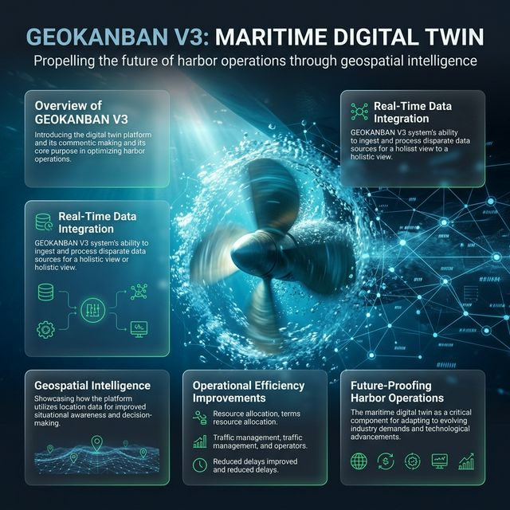

# 🏗️ GeoKanban V3: Maritime Digital Twin & Security Blueprint

## ⚓ Visione Generale

GeoKanban V3 non è un semplice software di tracciamento; è un **Digital Twin Marittimo** progettato per trasformare dati grezzi in intelligenza operativa. La piattaforma integra flussi AIS in tempo reale, analisi geo-spaziale poligonale e una suite di sicurezza di livello bancario per offrire una "Single Source of Truth" ai porti e alle flotte moderne.

---

## 🛡️ Architettura di Sicurezza (50% Tecnico)

La sicurezza in GeoKanban V3 è implementata "by design" attraverso tre pilastri fondamentali:

### 1. Row-Level Security (RLS) Blindata
A differenza delle applicazioni tradizionali che filtrano i dati nel codice (molto rischioso), GeoKanban delega la sicurezza direttamente al cuore del database PostgreSQL.
- **Isolamento Fisico**: Ogni query eseguita dal profilo `Crew` viene filtrata dal kernel del database tramite policy RLS. Un marinaio non può "vedere" o "intercettare" i dati di una nave concorrente o di un altro armatore, anche se tentasse di hackerare l'API.
- **Zero-Trust Access**: Ogni richiesta è validata tramite JWT (JSON Web Tokens) emessi da Supabase Auth.

### 2. Digital Fingerprinting & Audit Trail (Phase 18)
Massima accountability anche in scenari di account condivisi.
- **Device Identification**: Ogni modifica al logbook cattura l'impronta digitale del dispositivo (User-Agent, Risoluzione, Persistent Device ID).
- **Immutabilità**: L'Audit Log registra lo stato "Prima" e "Dopo" di ogni modifica, rendendo ogni azione tracciabile e verificabile in caso di contestazioni assicurative o legali.

### 3. Integrità Crittografica (SHA-256)
Quando un ufficiale certifica un'attività, il sistema genera un **Hash Digitale univoco** del contenuto. 
- Qualsiasi tentativo di manomissione postuma invaliderebbe l'hash, garantendo l'integrità legale dei documenti nautici.

---

## 🛰️ Potenzialità & Intelligenza Operativa (50% Descrittivo)

### 🗺️ Geospatial Intelligence (PostGIS)
Dimenticate i semplici raggi di prossimità. GeoKanban utilizza l'estensione **PostGIS** per calcoli poligonali precisi al centimetro. 
- Il sistema capisce autonomamente se una nave è "dentro" o "fuori" un cantiere, eliminando l'errore umano nell'input dei dati di produzione.

### 📊 Business Intelligence Backend-Driven
I KPI (Key Performance Indicators) non appesantiscono il tuo smartphone. 
- Tutti i calcoli (Dwell Time, Production Target, Trip Counts) avvengono sul server tramite **Viste SQL Materializzate**. Questo garantisce un'app fluida e veloce anche con migliaia di navi in monitoraggio.

### 📱 PWA & UX Mobile Excellence
Un'esperienza "App-Like" senza i vincoli degli app store.
- **Nautical Time Picker**: Interfaccia ottimizzata per il touch per inserire manovre con un solo pollice.
- **Offline Readiness**: Progettata per resistere ai cali di segnale tipici dell'ambiente marino.

---

## 💡 Best Practices Onerate
- **Clean Architecture**: Disaccoppiamento totale tra calcolo (SQL) e visualizzazione (React).
- **Performance First**: Minimizzazione del payload JSON per ridurre il consumo di dati su reti satellitari.
- **Scalabilità**: Infrastruttura pronta a scalare da una singola unità a intere flotte continentali senza degradazione delle performance.

> [!TIP]
> **GeoKanban V3** è il futuro della digitalizzazione portuale: sicuro, preciso, infallibile.
